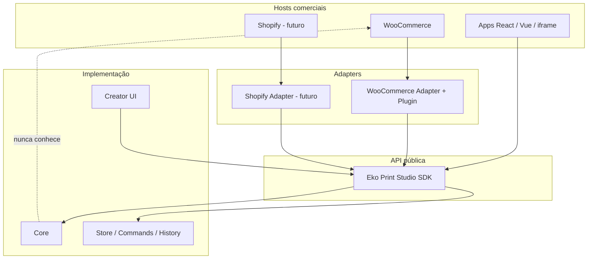
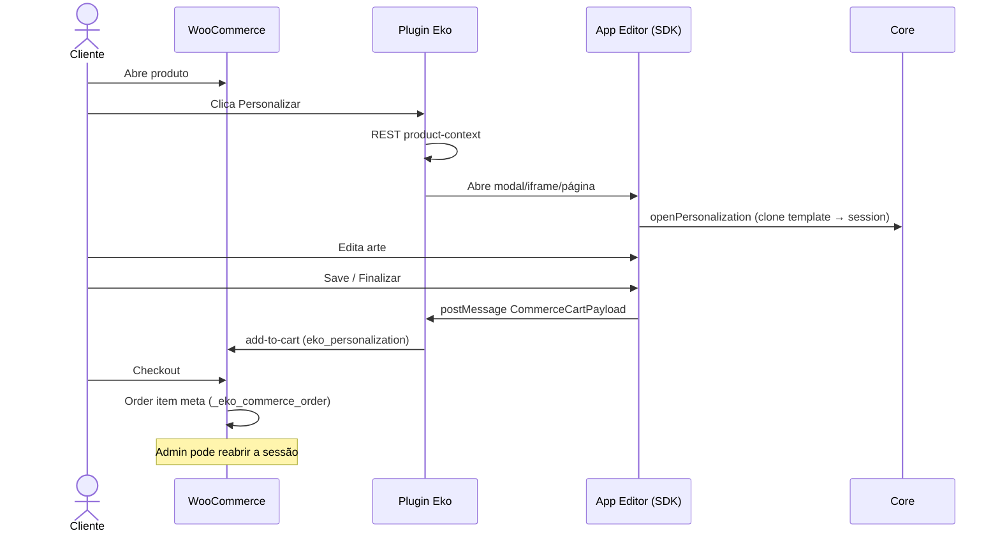

# 01 — Introdução

## O que é o Eko Print Studio?

O **Eko Print Studio** é uma plataforma profissional de **Web-to-Print**: um editor gráfico reutilizável que permite personalizar produtos (canecas, camisetas, agendas, embalagens etc.) dentro de e-commerces e aplicações web.

Ele **não** é um aplicativo monolith acoplado a uma loja específica.

Ele é:

- um **Core** de domínio (documento, comandos, histórico, interação, renderização)
- um **SDK** público para embutir o editor em qualquer host
- **Adapters** por plataforma (hoje WooCommerce; amanhã Shopify, Magento, …)
- um **plugin WooCommerce** fino que só conecta a loja ao SDK

**Referência de experiência:** Canva (simples, rápida, poucos cliques).  
**Referência de arquitetura:** plataforma desacoplada embarcável (como um “Stripe Elements”, porém para print).

---

## Por que existe?

Lojas precisam:

1. Oferecer personalização no produto
2. Guardar a arte no carrinho e no pedido
3. Reabrir a personalização no admin / produção

Sem uma plataforma separada, cada integração (Woo, Shopify, app React) reinventaria o editor. O Eko Print Studio concentra a inteligência no Core/SDK e deixa cada loja com um **adaptador fino**.

---

## Quando utilizar?

Use o Eko Print Studio quando você precisa:

- Personalizar arte gráfica ligada a um SKU / variação
- Persistência de sessão de personalização no checkout
- Preview e payload padronizado para produção
- Integração via adapters (sem modificar o Core)

Não use (ainda) como:

- Desktop DTP completo (Illustrator / InDesign) — fora do escopo atual
- Pipeline de impressão CMYK/PDF pronto para gráfica — **parcialmente preparado**; export raster/PDF completo é evolução futura via `ExportProvider`

---

## Arquitetura de alto nível

### Diferença entre as camadas

| Camada | O que é | Pode conhecer WooCommerce? |
|--------|---------|----------------------------|
| **Core** | Domínio: documento, regras, engines, render pipeline | **Não** |
| **SDK** | Fachada pública (`EkoPrintStudio`, eventos, sessão) | Não (só contratos genéricos de commerce) |
| **Adapter** | Traduz produto/carrinho/pedido da loja ↔ SDK | Sim (só daquela loja) |
| **Plugin WooCommerce** | PHP + JS na loja: botão, REST, meta do carrinho/pedido | Sim |

> **Atenção:** nenhuma inteligência de edição deve viver no plugin PHP. O plugin **abre** o editor e **persiste payloads**. Quem edita é o SDK/Core.

---

## Fluxo geral da plataforma

---

## Peças que você vai instalar

1. **Repositório do editor** (este repo) — Vite + React + SDK  
2. **Plugin WordPress** em `integrations/woocommerce/eko-print-studio/`  
3. **WordPress + WooCommerce** (local ou servidor)

Template de demonstração incluído: **`template_caneca-brasil`**.

---

## Screenshot placeholders

| ID | Onde usar |
|----|-----------|
|  | Editor aberto localmente |
|  | Página do produto Woo |
|  | Embed modal |
|  | Item do carrinho |
|  | Painel do pedido |

> Substitua os arquivos em `docs/assets/screenshots/` quando as capturas reais estiverem disponíveis.

---

## Próximo passo

→ [02 — Desenvolvimento local](./02-local-development.md)

---

## Checklist

- [ ] Entendi Core ≠ SDK ≠ Adapter ≠ Plugin
- [ ] Sei que o Core nunca importa WordPress
- [ ] Sei o fluxo: produto → editor → carrinho → pedido → reopen admin
