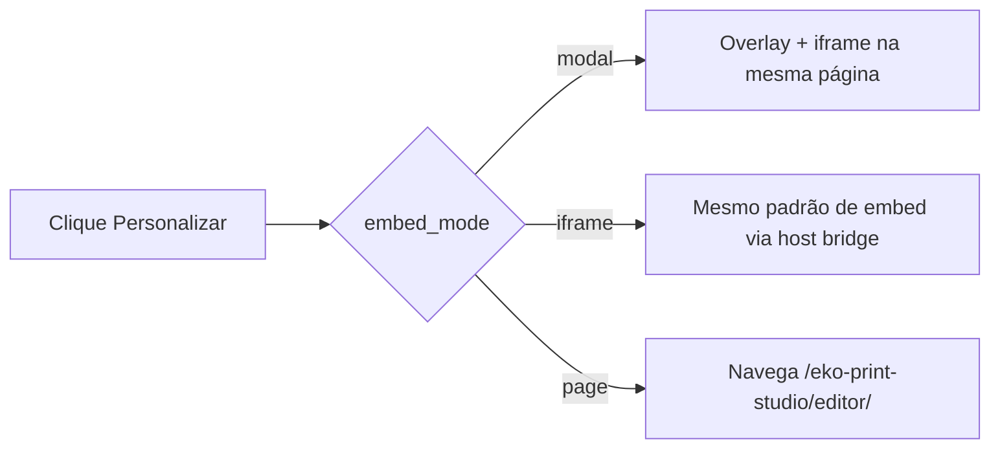

# 03 — Plugin WooCommerce (tutorial completo)

## O que é?

O plugin **Eko Print Studio for WooCommerce** (v0.8.1) é um **adaptador comercial**. Ele:

- Mostra o botão **Personalizar**
- Abre o editor (modal / iframe / página)
- Envia o contexto do produto
- Recebe o `CommerceCartPayload`
- Persiste no **carrinho** e no **pedido**
- Permite **reabrir** no admin

Ele **não** contém o motor de edição.

## Por que existe?

Para o lojista instalar algo familiar (plugin WP) sem embarcar React/Konva dentro do tema.

## Quando utilizar?

Em qualquer loja WooCommerce que vá vender produtos personalizáveis com o Eko Print Studio.

---

## Pré-requisitos

1. Editor acessível por URL (`npm run dev` ou build hospedado) — ver [02](./02-local-development.md)
2. WordPress 6+ e WooCommerce 7+
3. PHP 8.0+
4. Capacidade de copiar pastas para `wp-content/plugins/`

---

## Passo 1 — Instalar o plugin

Copie a pasta do repositório:

```text
origem:  integrations/woocommerce/eko-print-studio/
destino: wp-content/plugins/eko-print-studio/
```

O arquivo principal deve ficar em:

```text
wp-content/plugins/eko-print-studio/eko-print-studio.php
```

Em **Plugins**, ative **Eko Print Studio for WooCommerce**.

**Resultado esperado:** aparece o submenu **WooCommerce → Eko Print Studio**.

> **Atenção:** se WooCommerce não estiver ativo, o plugin mostra um aviso e não faz boot completo.

---

## Passo 2 — Permalinks

1. **Configurações → Links permanentes**
2. **Salvar alterações**

Isso registra:

```text
/eko-print-studio/editor/
```

usada no modo **página dedicada**.

---

## Passo 3 — Configuração do painel

Abra **WooCommerce → Eko Print Studio**.

| Campo | O que colocar | Exemplo |
|-------|---------------|---------|
| **URL do Editor** | URL pública do app Vite/build | `http://localhost:5173` |
| **Modo de abertura** | Como o editor aparece | `Modal` / `Iframe` / `Página dedicada` |
| **Idioma** | Hint para o host/SDK | `pt-BR` |
| **Tema** | `canva` \| `light` \| `dark` | `canva` |
| **Ambiente** | `development` \| `production` | `development` |
| **Timeout (ms)** | Timeout de operações host | `30000` |
| **Autosave (ms)** | Intervalo pedido ao SDK | `15000` |
| **Target Origin** | Origem postMessage | `http://localhost:5173` ou `*` |
| **Texto do botão** | Label na página do produto | `Personalizar` |
| **Preview habilitado** | Flag de configuração | ligado |
| **Exigir personalização no checkout** | Bloqueia checkout sem meta | opcional |
| **Debug** | Auditoria em option | ligado em dev |

Clique **Salvar configurações**.

> 

---

## Passo 4 — Modos de abertura



| Modo | Comportamento implementado |
|------|----------------------------|
| **Modal** | Overlay fullscreen com iframe apontando para a URL do editor + query params |
| **Iframe** | Mesmo host bridge (overlay); o valor é consumido como modo de embed nos params |
| **Página dedicada** | Redireciona para `/eko-print-studio/editor/?…` (shell PHP com iframe) |

> **A confirmar no seu tema:** alguns temas com CSP estrita podem bloquear iframes. Veja Troubleshooting.

---

## Passo 5 — Criar / configurar o produto

1. **Produtos → Adicionar**
2. Defina nome, preço, publique
3. Em **Dados do produto → Geral**, localize **Eko Template ID**
4. Preencha: `template_caneca-brasil` (demo do repositório)
5. **Template mode** (preparado):
   - `Unique template` — padrão
   - `Per variation` / `Dynamic` / `Category` / `Collection` — **preparados** (meta de variação já existe; resolução dinâmica completa: **a evoluir**)

**Resultado esperado:** na página do produto aparece o botão **Personalizar**.

> 

### Shortcode (opcional)

```text
[eko_personalize product_id="123" label="Personalizar"]
```

Funciona em páginas clássicas / blocos que aceitam shortcode.

---

## Passo 6 — Abrir o editor e personalizar

1. Abra o produto na loja (front)
2. (Opcional) escolha variação / quantidade
3. Clique **Personalizar**
4. O host chama:

```http
GET /wp-json/eko-print/v1/product-context/{productId}
```

5. O editor abre com query params (`templateId`, `productId`, `embed`, `theme`, …)
6. O app do editor executa `bootWooCommerceFromUrl` → `openPersonalization`

> 

Edite textos / imagens / formas (fluxo Creator).

---

## Passo 7 — Salvar e adicionar ao carrinho

1. No editor (modo commerce), clique **Save**
2. Isso chama `finalizeCustomization()` no adapter
3. O editor envia `postMessage` (`woocommerce.cart.add` + payload)
4. O host chama:

```http
POST /wp-json/eko-print/v1/add-to-cart
```

5. Você é redirecionado ao carrinho

**Resultado esperado:**

- Item no carrinho com dados visíveis (“Personalização · sessão …”)
- Meta interna `eko_personalization` (contrato `eko.commerce.cart/1`)

> 

```ascii
+----------------------------------+
| Caneca Brasil            R$ 59  |
| Personalização: sessão abc123… |
| Arte: Caneca Brasil (session)  |
+----------------------------------+
```

---

## Passo 8 — Finalizar o pedido

Conclua o checkout normalmente.

**Resultado esperado:** no item do pedido existem metas:

| Meta | Conteúdo |
|------|----------|
| `_eko_commerce_order` | JSON `CommerceOrderPayload` |
| `_eko_session_id` | Session id |
| `_eko_template_id` | Master / template id |
| `_eko_contract_version` | `eko.commerce.cart/1` |
| `_eko_preview` | Preview ref (quando presente) |

---

## Passo 9 — Reabrir no admin

1. Abra o pedido em **WooCommerce → Pedidos**
2. No item, painel **Eko Print Studio**
3. Clique **Reabrir Personalização** ou **Abrir Editor**

Isso busca:

```http
GET /wp-json/eko-print/v1/order-payload/{orderId}/{itemId}
```

(requer capability `edit_shop_orders`) e abre o editor com `sessionId`.

> 

> **Pendente de implementação:** edição completa “in-place” de PDF de produção no admin. A reabertura usa a sessão/payload via SDK.

---

## REST — referência rápida

| Método | Rota | Auth |
|--------|------|------|
| GET | `/eko-print/v1/product-context/{id}` | nonce `wp_rest` (header `X-WP-Nonce`) |
| POST | `/eko-print/v1/validate-cart` | nonce |
| POST | `/eko-print/v1/add-to-cart` | nonce |
| GET | `/eko-print/v1/order-payload/{order}/{item}` | `edit_shop_orders` |
| POST | `/eko-print/v1/audit` | nonce |

---

## Segurança (o que o plugin já faz)

- Validação + sanitização de cart payload (`PayloadValidator`)
- Limite de tamanho (~1.5MB JSON)
- Nonce nas rotas de loja
- Capability no reopen de pedido
- Core / SDK **não** são embutidos no PHP

---

## Checklist

### O que deve funcionar

- [ ] Botão Personalizar no produto com Template ID
- [ ] Editor abre no modo escolhido
- [ ] Save finaliza e adiciona ao carrinho
- [ ] Pedido guarda meta Eko
- [ ] Admin reabre sessão

### Como validar

- [ ] DevTools → Network: `product-context` e `add-to-cart` 200
- [ ] Carrinho mostra linha “Personalização”
- [ ] Order item meta `_eko_commerce_order` não vazia

### Erros mais comuns

- URL do Editor vazia
- Template ID errado / vazio (botão some)
- Permalinks
- CORS / origem postMessage
- Nonce expirado (recarregue a página do produto)

→ [05 — Troubleshooting](./05-troubleshooting.md)
