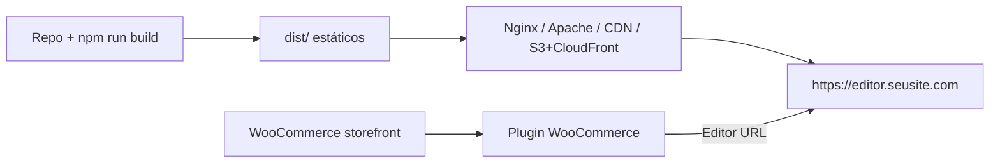

# 04 — Produção

## O que é?

Este guia cobre **publicar** o editor Eko Print Studio e **apontar** o plugin WooCommerce para a URL de produção.

## Por que existe?

Desenvolvimento (`npm run dev`) não é adequado para lojas reais:

- sem HTTPS estável
- HMR e CORS locais
- Machine do desenvolvedor não é o CDN do cliente

## Quando utilizar?

Quando a loja WooCommerce já funciona em staging/produção e você precisa do editor acessível por URL pública.

---

## Visão do deploy



---

## 1. Gerar o build

No repositório do editor:

```bash
npm ci
npx tsc --noEmit
npm run build
```

**O que acontece:**

1. `tsc --noEmit` — garante tipos limpos
2. `vite build` — gera HTML/JS/CSS em `dist/`

**Resultado esperado:**

```text
dist/
  index.html
  assets/
    index-....js
    index-....css
    ...
```

> **Dica:** rode `npm test` antes do deploy. Quebrar testes localmente evita publicar regressões de commerce.

---

## 2. Hospedar o editor

O editor é um **SPA estático**. Qualquer host de arquivos estáticos serve.

### Opções comuns

| Host | Adequado? | Notas |
|------|-----------|-------|
| Nginx | Sim | Precisa fallback SPA (`try_files … /index.html`) |
| Apache | Sim | `FallbackResource` ou rewrite para `index.html` |
| Netlify / Vercel / Cloudflare Pages | Sim | Configure SPA rewrite |
| S3 + CloudFront | Sim | Error document → `index.html` |
| Dentro do WordPress (`wp-content/…`) | Possível | **A confirmar** cache/CDN do tema |

### Nginx (exemplo)

```nginx
server {
  listen 443 ssl http2;
  server_name editor.seusite.com;

  ssl_certificate     /etc/letsencrypt/live/editor.seusite.com/fullchain.pem;
  ssl_certificate_key /etc/letsencrypt/live/editor.seusite.com/privkey.pem;

  root /var/www/eko-print-studio/dist;
  index index.html;

  location / {
    try_files $uri $uri/ /index.html;
  }

  # Cache longo para assets com hash
  location /assets/ {
    expires 7d;
    add_header Cache-Control "public, immutable";
  }
}
```

### Apache (exemplo)

```apache
<VirtualHost *:443>
  ServerName editor.seusite.com
  DocumentRoot /var/www/eko-print-studio/dist

  <Directory /var/www/eko-print-studio/dist>
    AllowOverride All
    Require all granted
    FallbackResource /index.html
  </Directory>
</VirtualHost>
```

### Validar hospedagem

1. Abra `https://editor.seusite.com` no navegador
2. O Creator deve carregar (mesmo sem query Woo)
3. DevTools → Network: `index.html` e chunks JS **200**
4. Sem mixed content (HTTP dentro de HTTPS)

> 

---

## 3. Apontar o plugin para produção

Em **WooCommerce → Eko Print Studio**:

| Campo | Valor de produção |
|-------|-------------------|
| URL do Editor | `https://editor.seusite.com` |
| Modo | `modal` ou `page` (escolha do UX) |
| Ambiente | `production` |
| Target Origin | `https://editor.seusite.com` (não use `*` em produção) |
| Debug | desligado (a menos que esteja investigando) |

Salve e teste um produto com Template ID.

**Resultado esperado:** Personalizar abre o editor HTTPS; Save adiciona ao carrinho.

---

## 4. CORS, cookies e origens

O fluxo oficial é **iframe do editor + postMessage + REST no WordPress**.

| Peça | Quem resolve |
|------|--------------|
| REST `/wp-json/eko-print/v1/*` | Mesma origem da loja → nonce WP |
| postMessage | Target Origin do plugin / adapter |
| Cookies da sessão WP | Ficam na loja, não no editor |

> **Atenção:** se o editor e a loja estão em domínios diferentes, isso é **esperado**. Não é necessário servir o editor no mesmo domínio, mas o Target Origin deve bater com a URL do editor.

---

## 5. Atualizar versões

### Editor (SPA)

1. No CI ou máquina de release: `git pull` / tag
2. `npm ci && npm test && npm run build`
3. Publique o conteúdo novo de `dist/` no host
4. Invalide CDN se houver cache

### Plugin WordPress

1. Substitua a pasta `wp-content/plugins/eko-print-studio/` pela nova versão do repositório
2. Não desative o WooCommerce no meio do processo
3. **Configurações → Links permanentes → Salvar** (garante rewrite)
4. Verifique settings (URL do Editor não deve ser apagada se o option key for o mesmo)

> **Pendente de implementação:** empacotamento `.zip` oficial no WordPress.org / updater automático. Hoje o update é **manual via pasta**.

### Semântica de versão (estado atual)

| Artefato | Versionamento |
|----------|---------------|
| `package.json` | `0.5.0` (privado) |
| Plugin header PHP | veja `eko-print-studio.php` |
| CHANGELOG | fases Unreleased v0.6–v0.8.1 |

---

## 6. Rollback

### Editor

1. Mantenha o `dist/` anterior em backup (`dist-prev/`) ou tags Git
2. Restaure os arquivos estáticos no host
3. Invalide CDN

### Plugin

1. Restaure a pasta anterior do plugin
2. Recarregue permalinks
3. Confirme que order meta antiga (`_eko_commerce_order`, schema `eko.commerce.cart/1`) ainda é lida — contratos versionados devem permanecer compatíveis

> **Atenção:** não misture um plugin novo que exige campos de payload com um editor antigo que gera schema diferente sem validar. Use a mesma release editor+plugin.

---

## Boas práticas

1. **HTTPS obrigatório** na loja e no editor
2. **Target Origin explícito** (nunca `*` em produção)
3. **Teste em staging** o fluxo completo: produto → editor → carrinho → pedido → reopen admin
4. **Backup** de options WP (`eko_print_*`) e meta de pedidos antes de updates grandes
5. **Mesma release** para SPA + plugin na loja
6. Monitore Network: `add-to-cart` e tamanho do JSON (plugin limita ~1.5MB)

---

## Lacunas conhecidas

| Item | Status |
|------|--------|
| Pipeline PDF/CMYK de gráfica | Evolução futura (`ExportProvider`) |
| Thumbnails raster no carrinho | Precisa ExportProvider; hoje preview pode ser **domínio JSON** |
| CDN + headers CORS do Vite preview | A confirmar por host |
| Pacote npm público do SDK | Pendente (repo `private`) |
| Docker Compose oficial | Pendente |

---

## Checklist

### O que deve funcionar

- [ ] `https://editor…` carrega o Creator
- [ ] Plugin aponta para essa URL
- [ ] Personalizar → Save → Carrinho → Pedido
- [ ] Reabrir no admin

### Como validar

- [ ] SSL válido (cadeia completa)
- [ ] Target Origin = origem do editor
- [ ] Order meta `_eko_commerce_order` presente após checkout

### Erros mais comuns

- Mixed content (HTTP editor em página HTTPS)
- SPA sem fallback → 404 em rotas profundas
- Target Origin `*` ou origem errada → postMessage ignorado
- Build antigo sem commerce boot → Save não finaliza

→ [05 — Troubleshooting](./05-troubleshooting.md)
