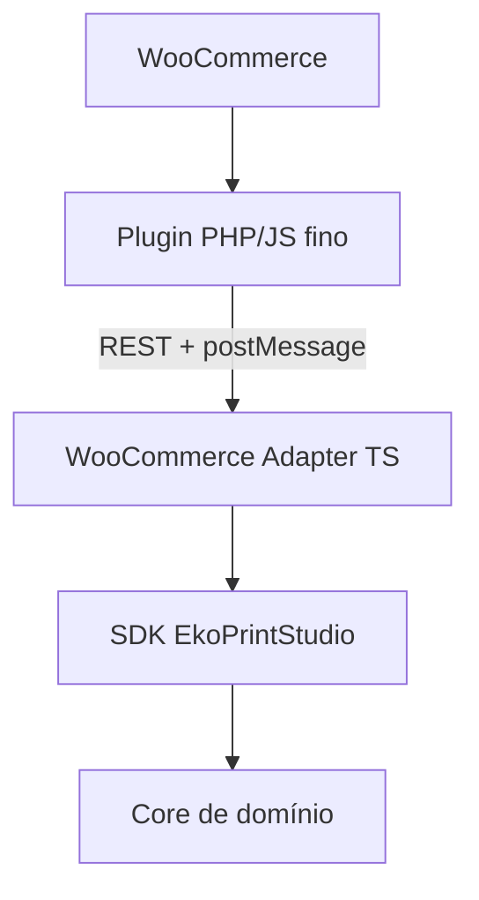
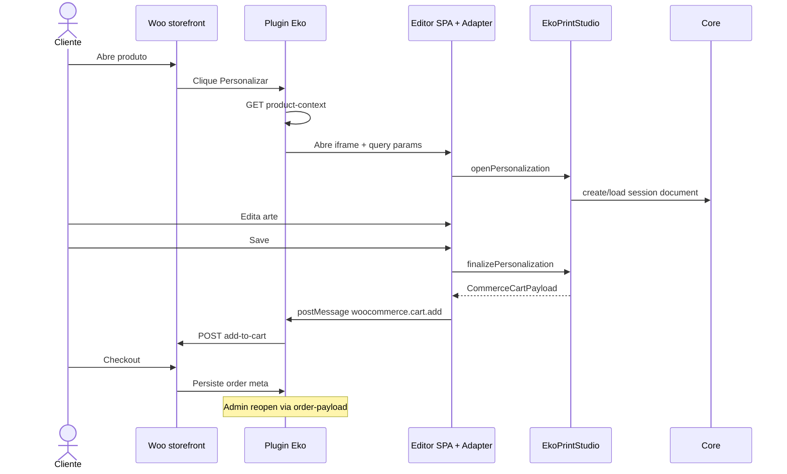
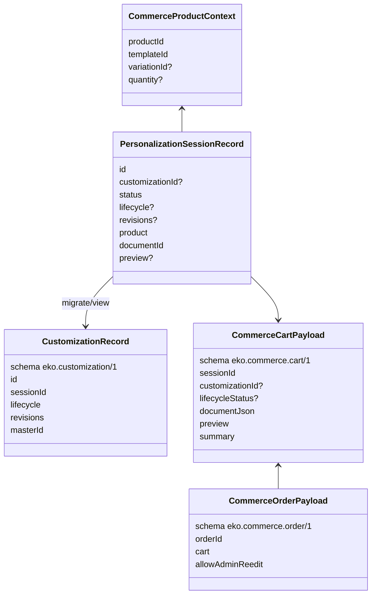
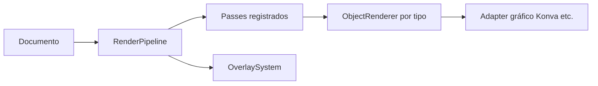
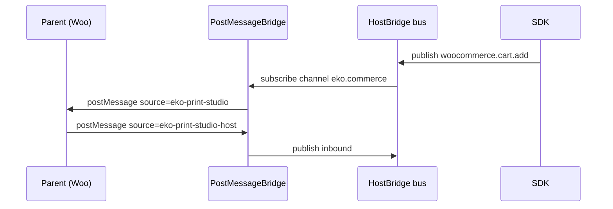
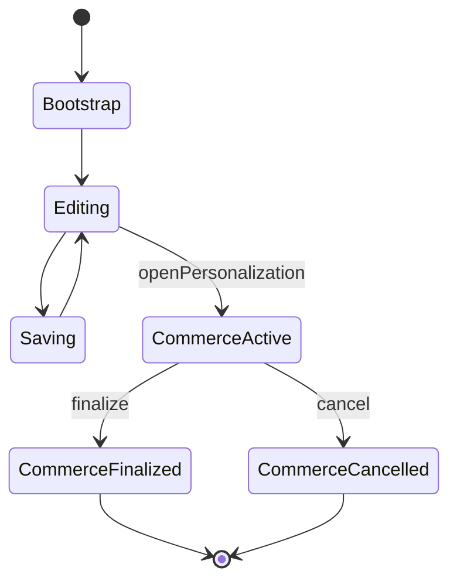

# 06 — Arquitetura (visão de produto)

## O que é este documento?

Visão **oficial** da arquitetura para integradores e novos desenvolvedores.

Foco em **entendimento**, não em cada arquivo interno.

Para detalhes legados de implementação, veja também [architecture.md](./architecture.md) (mais técnico).

---

## Por que esta arquitetura?

Objetivo: o **mesmo editor** servir WooCommerce hoje e outras lojas amanhã, **sem** misturar regra de WordPress no motor gráfico.



---

## Camadas — o que cada uma faz

| Camada | Responsabilidade | O que **não** faz |
|--------|------------------|-------------------|
| **Core** | Documento, comandos, histórico, interação, render pipeline, registry, eventos de plataforma | Não conhece React, Konva, Woo, WP, HTTP |
| **SDK** | Fachada pública (`EkoPrintStudio`), sessão Creator, commerce sessions, postMessage helpers | Não implementa checkout Woo |
| **Adapters** | Traduzem SDK ↔ host (ex.: meta `eko_personalization`) | Não reimplementam o editor |
| **Plugin Woo** | Settings, botão, REST, carrinho, pedido, admin reopen | Não embute Core/React |

### Por que o Core nunca conhece WordPress?

Porque qualquer `import` de WP/Woo no Core:

- impede reuso em Shopify / app nativo
- acopla testes a PHP
- quebra a regra de plataforma embarcável

O Core só fala em **documento**, **comando**, **providers** e **eventos**.

---

## Fluxo completo (loja → arte → pedido)



---

## Contratos públicos

Os adapters **não** inventam JSON livre. Usam contratos em `src/types/commerce.ts`:

| Contrato | Schema | Uso |
|----------|--------|-----|
| `CommerceCartPayload` | `eko.commerce.cart/1` | Meta do item no carrinho |
| `CommerceOrderPayload` | `eko.commerce.order/1` | Meta do item no pedido |
| `CommerceProductContext` | — | Contexto produto → editor |
| `ProductionPreviewRef` | — | Preview leve (domain ou raster) |
| `PersonalizationSessionRecord` | — | Persistência de sessão (+ campos Customization) |
| `CustomizationRecord` | `eko.customization/1` | Visão de negócio (lifecycle, revisions) |



Alterar o schema exige **versão nova** (`/2`) — não quebre lojas antigas em silêncio. Campos opcionais (`customizationId`, `lifecycleStatus`) são aditivos em `cart/1`.

---

## Providers

O SDK/Core dependem de **interfaces**, não de arquivos no disco.

| Provider | Papel |
|----------|--------|
| `DocumentProvider` | Carregar / salvar / criar sessão a partir de master |
| `PersistenceProvider` / `SessionPersistenceProvider` | Persistência de documento (+ sessões) |
| `ExportProvider` | Preview oficial / export |
| `CommerceProvider` | Orquestração storefront (abrir, finalizar, carrinho, host) |

```text
CommerceProvider
        │
┌───────┴────────────┬─────────────┬──────────────┐
WooCommerce          Shopify       Magento        Nuvemshop / …
```

O App usa `bootCommerceFromUrl` — **nunca** import direto de uma loja. Implementações concretas: `src/adapters/*` + stubs em `src/providers/commerce/stubs/`.

**Quando utilizar providers customizados?** Apps embarcados, backends próprios, ou nova plataforma de comércio.

> **Pendente:** provedores de produção tipográfica avançada (CMYK, imposições).

---

## Event Bus

`platformEvents` é o catálogo estável para hosts:

```text
document.opened | document.saved | selection.changed | …
commerce.session.started | commerce.cart.ready | …
ui.notify | ui.confirm | …
```

Assine via SDK:

```ts
editor.on(platformEvents.DocumentSaved, (payload) => { /* … */ })
```

**Por que existe?** Desacopla UI, adapters e telemetria sem callbacks rígidos espalhados.

---

## Render Pipeline



- **Object Registry** — tipos de objeto (text, shape, image, …) e capacidades
- **Renderer Registry** — como cada tipo desenha (contrato; Konva fora do Core)
- **Overlay System** — guias, seleção, handles (camada acima do conteúdo)
- **Passes** — etapas encaixáveis no pipeline

Integradores avançados registram via `editor.register({ kind: 'renderer' | 'object' | 'pass' | … })`.

---

## Plugin System (editor)

Não confundir com o **plugin WordPress**.

No Core/SDK, `EditorPlugin` permite empacotar:

- objetos
- renderers
- overlays
- passes

Registrados pela fachada `EkoPrintStudio.register`.

---

## Host Bridge + postMessage



O Core define o **HostBridge** sem APIs de browser; o SDK liga ao `window.postMessage`.

---

## Object Registry (resumo)

Centraliza:

- definição do tipo de elemento
- propriedades editáveis
- capabilities (resize, rotate, …)

A UI Creator e o Property Engine consomem o registry via sessão/SDK — não duplicam regras por painel.

---

## Estado da UI Creator



`EditorSession` expõe snapshot estável para React (`useEditorSnapshot`).

---

## O que NÃO aprofundar aqui

- Detalhe de cada command handler
- Internals do KonvaAdapter
- Implementação PHP linha a linha

Use o código + testes (`tests/commerce/*`) como fonte de verdade comportamental.

---

## Lacunas arquiteturais (honestas)

| Tema | Status |
|------|--------|
| Adapter Shopify / Magento | Futuro |
| Pacote npm versionado do SDK | Pendente |
| Export produção gráfica completo | Parcial (hooks) |
| Multi-tenant SaaS hosted | Fora do escopo atual do repo |

---

## Checklist de compreensão

### O que você deve conseguir explicar

- [ ] Diferença Core vs SDK vs Adapter vs Plugin WP
- [ ] Por que o Core não importa WordPress
- [ ] O que é `CommerceCartPayload`
- [ ] Como postMessage liga iframe ↔ loja

### Como validar o entendimento

- [ ] Seguir o exemplo [local](./examples/local.md) sem abrir o Core
- [ ] Ler [SDK Public API](./sdk/public-api.md) e reconhecer os métodos de commerce

### Erros conceituais comuns

- Colocar lógica Woo dentro de `src/core`
- Tratar o plugin PHP como o editor
- Assumir que preview JSON = arquivo de gráfica
