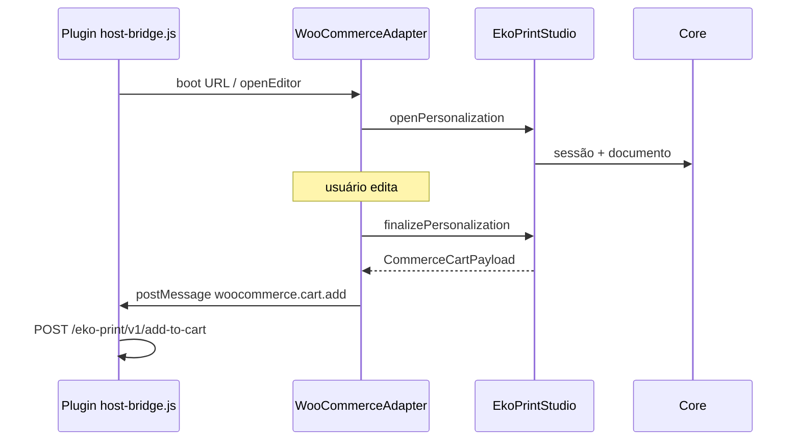
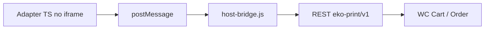

# Adapter WooCommerce

## O que é?

Há **duas peças** com nomes parecidos:

| Peça | Onde mora | Runtime |
|------|-----------|---------|
| **WooCommerce Adapter (TS)** | `src/adapters/woocommerce/` | Dentro do **editor SPA** |
| **Plugin WordPress** | `integrations/woocommerce/eko-print-studio/` | **PHP + JS** na loja |

Este documento cobre o **adapter TypeScript** e como ele se encaixa com o plugin.

Tutorial do plugin: [03 — Plugin WooCommerce](../03-woocommerce-plugin.md).

---

## Por que existe?

O SDK fala em `CommerceCartPayload`. O Woo precisa de:

- cart item data `eko_personalization`
- REST `add-to-cart`
- order meta `_eko_commerce_order`

O adapter **traduz** SDK → vocabulário Woo **sem** importar Core.

## Quando utilizar?

Sempre que o editor for aberto a partir do fluxo Woo (query URL / boot).

Para outra loja (Shopify…), crie **outro** adapter — não estenda este com `if (shopify)`.

---

## Fluxo



Boot helper: `bootWooCommerceFromUrl` (lê query params e inicia o adapter).

---

## API do `WooCommerceAdapter`

### Construtor

```ts
import { WooCommerceAdapter } from '@/adapters/woocommerce'

const woo = new WooCommerceAdapter({
  editorOptions: { documentProvider },
  defaultEmbedMode: 'modal',
  targetOrigin: 'https://loja.exemplo.com', // origem do parent; ou '*'
})
```

| Opção | Descrição |
|-------|-----------|
| `editor` | Instância `EkoPrintStudio` pré-criada |
| `editorOptions` | Passadas ao criar o SDK |
| `defaultEmbedMode` | `modal` (default) \| `iframe` \| `page` |
| `targetOrigin` | postMessage origin (default `*`) |

---

### `openEditor({ product, embedMode?, sessionId?, autosaveMs?, hostWindow? })`

Abre personalização; opcionalmente liga `bindPostMessageTransport` se `hostWindow` for passado.

---

### `saveCustomization(): Promise<CommerceCartPayload>`

Chama `savePersonalization`.

---

### `finalizeCustomization(): Promise<CommerceCartPayload>`

Finaliza e publica no bus:

```text
channel: eko.commerce
type:    woocommerce.cart.add
payload: { eko_personalization: CommerceCartPayload }
```

---

### `cancelCustomization()` / `reopenSession(sessionId)` / `reopenFromOrder(order)`

Cancelar / retomar / admin recovery.

---

### `preview(): Promise<ProductionPreviewRef>`

---

### `toWooCartMeta(cart?): WooCommerceCartLineData`

```ts
{ eko_personalization: cart }
```

---

### `attachToOrder(orderId, lineItemId?, cart?)`

Monta `CommerceOrderPayload` e publica `woocommerce.order.attach`.

---

### `getEditor()` / `getLastCart()` / `destroy()`

Acesso à fachada, último cart e cleanup do transport.

---

## Eventos relevantes

### Via Host bus / postMessage

| type | Direção | Payload |
|------|---------|---------|
| `embed.request` | Editor → Host | `{ mode, productId?, templateId? }` |
| `woocommerce.cart.add` | Editor → Host | `{ eko_personalization: CommerceCartPayload }` |
| `woocommerce.order.attach` | Editor → Host | `CommerceOrderPayload` |
| `personalization:opened` | callback host | `{ sessionId, embedMode }` |
| `personalization:finalized` | callback host | `CommerceCartPayload` |
| `personalization:cancelled` | callback host | `{ sessionId }` |

### Via `platformEvents` no SDK

`SessionStarted`, `SessionFinalized`, `CartPayloadReady`, `PreviewGenerated`, etc. — ver [public-api](../sdk/public-api.md).

---

## Payloads

### Cart (`eko.commerce.cart/1`)

Armazenado pelo plugin como cart item data `eko_personalization`.

Campos críticos: `schema`, `sessionId`, `documentJson`, `preview`, `summary`, `product`.

### Order (`eko.commerce.order/1`)

Persistido em meta `_eko_commerce_order` (+ ids auxiliares). Contém `cart` completo e `allowAdminReedit`.

> O plugin PHP valida e sanitiza — não envie HTML livre no JSON.

---

## Como integrar (app do editor)

1. Detectar query Woo (`productId`, `templateId`, `embed`, …)
2. Instanciar adapter com `DocumentProvider` do app
3. `openEditor` / `bootWooCommerceFromUrl`
4. No Save commerce: `finalizeCustomization`
5. Garantir postMessage ligado ao `parent`

O **App Creator oficial** já faz o boot commerce — use-o como referência.

---

## Como estender

Extensões **seguras**:

- Mapear campos extras em `product.hostMeta` (sem mudar schema)
- Escutar eventos e enviar analytics
- Trocar `sessionStore` / `ExportProvider` via `editorOptions`

Evite:

- Importar `@/core` no adapter
- Forkar o schema sem bump (`/2`)
- Colocar regras PHP no TypeScript adapter

---

## Como substituir

Para outro host:

1. Copie o padrão do adapter (SDK only)
2. Publique eventos no mesmo HostBridge **ou** no contrato da nova loja
3. Escreva um plugin/host fino separado
4. Mantenha `CommerceCartPayload` como troca estável

```text
ShopifyAdapter  →  Shopify App / Checkout UI extensions
MagentoAdapter  →  Magento module
```

Status Shopify/Magento: **pendente de implementação**.

---

## Relação com o plugin PHP



O adapter **não** chama REST Woo diretamente no fluxo oficial; o **parent** (plugin) chama.

---

## Checklist

### O que deve funcionar

- [ ] `finalizeCustomization` gera schema `eko.commerce.cart/1`
- [ ] Host recebe `woocommerce.cart.add`
- [ ] Plugin adiciona ao carrinho

### Como validar

- [ ] `npm test -- tests/commerce/WooCommerceAdapter.test.ts`
- [ ] Fluxo manual [03](../03-woocommerce-plugin.md)

### Erros mais comuns

- Target Origin errado
- Adapter sem DocumentProvider
- Esperar que o adapter sozinho escreva no MySQL do WP
