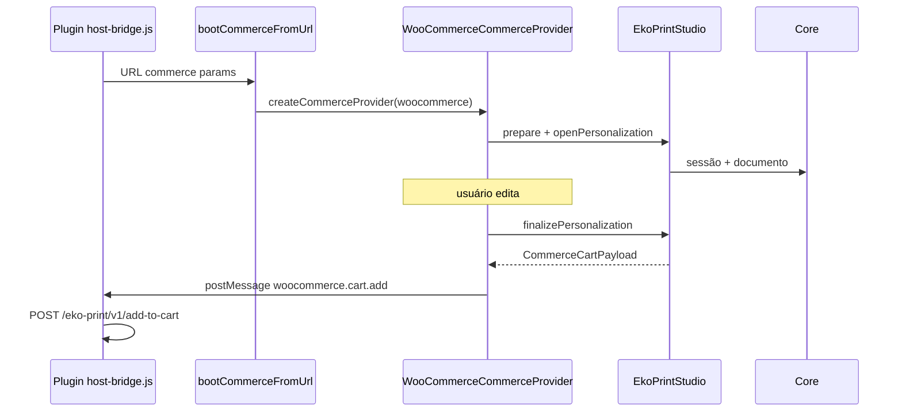
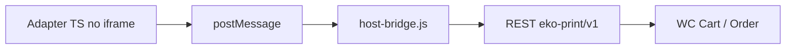

# Adapter WooCommerce

## O que é?

Há **duas peças** com nomes parecidos:

| Peça | Onde mora | Runtime |
|------|-----------|---------|
| **WooCommerceCommerceProvider** | `src/adapters/woocommerce/` | Dentro do **editor SPA** (implementa `CommerceProvider`) |
| **Plugin WordPress** | `integrations/woocommerce/eko-print-studio/` | **PHP + JS** na loja |

O SDK/App **não** importam WooCommerce. Eles usam `bootCommerceFromUrl` → `createCommerceProvider({ platform: 'woocommerce' })`.

`WooCommerceAdapter` permanece como fachada **deprecated** sobre `WooCommerceCommerceProvider`.

Tutorial do plugin: [03 — Plugin WooCommerce](../03-woocommerce-plugin.md).

---

## Persistência de sessão (produção)

No embed commerce, o host passa `restUrl` + `persistenceToken` (vindos de `product-context`).

O editor chama `createCommercePersistence` → **WooCommercePersistenceProvider** (primary) + **LocalPersistenceProvider** (fallback/mirror).

```text
start/autosave/finalize
  → SessionPersistenceProvider.saveSession(record, document)
  → PUT /wp-json/eko-print/v1/sessions/{id}
  → SessionRepository (CPT eko_ps_session)
```

O manager SDK **não** conhece WooCommerce — só a interface. localStorage não é o mecanismo principal quando as credenciais REST estão presentes.

## Export / preview (produção)

No boot commerce, `createSessionExport({ includeRaster: true })` configura **CompositeExportProvider** (Domain + Raster).

```text
save / finalize
  → ExportProvider.createSessionPreview(document)
  → ProductionPreviewRef { format: png, filename: preview.png, domainData }
  → record.preview  (persistido no mesmo saveSession — sem chamada extra)
```

O contract de Persistence **não muda**: apenas recebe o preview já produzido.

## Apresentação Woo (preview lifecycle)

```text
finalize → postMessage woocommerce.cart.add { preview, customizationId, lifecycleStatus }
  → host-bridge salva estado PDP (sessionStorage) + renderiza miniatura oficial
  → REST add-to-cart (reusa linha se mesmo sessionId / customizationId)
  → SessionRepository.lifecycle = cart_attached
  → CartPersistence / checkout / order meta `_eko_preview` + `_eko_customization_id`
```

| Superfície | Fonte da imagem |
|------------|-----------------|
| PDP | `record.preview` do payload (host-bridge) |
| Carrinho / mini-cart / checkout | `cart_item.eko_personalization.preview` |
| Pedido (admin) | `_eko_preview` / `cart.preview` |

Sem regeneração no PHP. Pedidos sem raster mantêm badge/legado.

## Customization (ciclo de vida no Woo)

O SDK traz a entidade **Customization**; o Woo só **referencia** ids:

```text
created → editing → saved → finalized → cart_attached → ordered
                         ↘ cancelável em qualquer passo pré-pedido
                         ↗ reabrir (Editar Personalização) → editing
```

| Momento | Identificadores |
|---------|-----------------|
| Abrir editor | `sessionId` na URL (= `customizationId` em v1) |
| Editar Personalização | host-bridge reusa `customizationId` / `sessionId` do sessionStorage |
| Carrinho | `eko_personalization.sessionId` + `.customizationId` + `.lifecycleStatus` |
| Pedido | `_eko_session_id`, `_eko_customization_id`, `_eko_customization_lifecycle=ordered` |

Registros antigos com apenas `sessionId` migram em leitura (`customizationId = sessionId`).

## Template Masters no produto

O seletor **Template Master** no admin do produto Woo lê o catálogo público do editor (`eko.templates.catalog/1`), não um campo de ID livre.

| Peça | Onde |
|------|------|
| Registry oficial | `src/core/templates/` (`TemplateRegistry` + builtins) |
| Catálogo público | `public/templates/catalog.json` (servido pelo Vite/build) |
| Host Woo | `integrations/woocommerce/.../config/TemplateCatalog.php` (+ JSON embutido + sync opcional) |
| Meta persistida | `_eko_template_id` (somente o id interno) |

O plugin **não importa** Core/TS. Ele consome o JSON do catálogo. O editor permanece independente do Woo.

## Por que existe?

O SDK fala em `CommerceCartPayload`. O Woo precisa de:

- cart item data `eko_personalization`
- REST `add-to-cart`
- order meta `_eko_commerce_order`

O adapter **traduz** SDK → vocabulário Woo **sem** importar Core.

## Quando utilizar?

Sempre que o editor for aberto a partir do fluxo Woo (query URL / boot).

Para outra loja (Shopify…), crie **outro** adapter — não estenda este com `if (shopify)`.

---

## Fluxo



Boot oficial: `bootCommerceFromUrl` (`@/providers/commerce`). Alias BC: `bootWooCommerceFromUrl`.

---

## API — `WooCommerceCommerceProvider` (CommerceProvider)

```ts
import { createCommerceProvider, bootCommerceFromUrl } from '@/providers/commerce'

const provider = createCommerceProvider({
  platform: 'woocommerce',
  editor,
  defaultEmbedMode: 'modal',
  targetOrigin: 'https://loja.exemplo.com',
})

await provider.prepare({ restUrl, persistenceToken: token })
await provider.start({ product, hostWindow: window.parent })
const cart = await provider.finalize() // → postMessage woocommerce.cart.add
provider.notifyHostClose()
```

| Método CommerceProvider | Papel |
|-------------------------|-------|
| `prepare` | Persistence (Woo REST) + Export raster |
| `start` / `reopen` | Abrir / retomar personalização |
| `save` / `finalize` / `cancel` | Ciclo de edição + handoff |
| `addToCart` / `updateCartItem` | Transporte host |
| `attachToOrder` | Payload de pedido |
| `notifyHostClose` | Fecha shell do host |

### Alias deprecated — `WooCommerceAdapter`

```ts
import { WooCommerceAdapter } from '@/adapters/woocommerce'
// openEditor → start, finalizeCustomization → finalize, …
const woo = new WooCommerceAdapter({ editor })
```

Finalize publica no bus:

```text
channel: eko.commerce
type:    woocommerce.cart.add
payload: { eko_personalization: CommerceCartPayload }
```

---

### `cancelCustomization()` / `reopenSession(sessionId)` / `reopenFromOrder(order)`

Cancelar / retomar / admin recovery.

---

### `preview(): Promise<ProductionPreviewRef>`

---

### `toWooCartMeta(cart?): WooCommerceCartLineData`

```ts
{ eko_personalization: cart }
```

---

### `attachToOrder(orderId, lineItemId?, cart?)`

Monta `CommerceOrderPayload` e publica `woocommerce.order.attach`.

---

### `getEditor()` / `getLastCart()` / `destroy()`

Acesso à fachada, último cart e cleanup do transport.

---

## Eventos relevantes

### Via Host bus / postMessage

| type | Direção | Payload |
|------|---------|---------|
| `embed.request` | Editor → Host | `{ mode, productId?, templateId? }` |
| `woocommerce.cart.add` | Editor → Host | `{ eko_personalization: CommerceCartPayload }` |
| `woocommerce.order.attach` | Editor → Host | `CommerceOrderPayload` |
| `personalization:opened` | callback host | `{ sessionId, embedMode }` |
| `personalization:finalized` | callback host | `CommerceCartPayload` |
| `personalization:cancelled` | callback host | `{ sessionId }` |

### Via `platformEvents` no SDK

`SessionStarted`, `SessionFinalized`, `CartPayloadReady`, `PreviewGenerated`, etc. — ver [public-api](../sdk/public-api.md).

---

## Payloads

### Cart (`eko.commerce.cart/1`)

Armazenado pelo plugin como cart item data `eko_personalization`.

Campos críticos: `schema`, `sessionId`, `documentJson`, `preview`, `summary`, `product`.

### Order (`eko.commerce.order/1`)

Persistido em meta `_eko_commerce_order` (+ ids auxiliares). Contém `cart` completo e `allowAdminReedit`.

> O plugin PHP valida e sanitiza — não envie HTML livre no JSON.

---

## Como integrar (app do editor)

1. Detectar query Woo (`productId`, `templateId`, `embed`, …)
2. Instanciar adapter com `DocumentProvider` do app
3. `openEditor` / `bootWooCommerceFromUrl`
4. No Save commerce: `finalizeCustomization`
5. Garantir postMessage ligado ao `parent`

O **App Creator oficial** já faz o boot commerce — use-o como referência.

---

## Como estender

Extensões **seguras**:

- Mapear campos extras em `product.hostMeta` (sem mudar schema)
- Escutar eventos e enviar analytics
- Trocar `sessionStore` / `ExportProvider` via `editorOptions`

Evite:

- Importar `@/core` no adapter
- Forkar o schema sem bump (`/2`)
- Colocar regras PHP no TypeScript adapter

---

## Como substituir

Para outro host:

1. Copie o padrão do adapter (SDK only)
2. Publique eventos no mesmo HostBridge **ou** no contrato da nova loja
3. Escreva um plugin/host fino separado
4. Mantenha `CommerceCartPayload` como troca estável

```text
ShopifyAdapter  →  Shopify App / Checkout UI extensions
MagentoAdapter  →  Magento module
```

Status Shopify/Magento: **pendente de implementação**.

---

## Relação com o plugin PHP



O adapter **não** chama REST Woo diretamente no fluxo oficial; o **parent** (plugin) chama.

---

## Checklist

### O que deve funcionar

- [ ] `finalizeCustomization` gera schema `eko.commerce.cart/1`
- [ ] Host recebe `woocommerce.cart.add`
- [ ] Plugin adiciona ao carrinho

### Como validar

- [ ] `npm test -- tests/commerce/WooCommerceAdapter.test.ts`
- [ ] Fluxo manual [03](../03-woocommerce-plugin.md)

### Erros mais comuns

- Target Origin errado
- Adapter sem DocumentProvider
- Esperar que o adapter sozinho escreva no MySQL do WP
