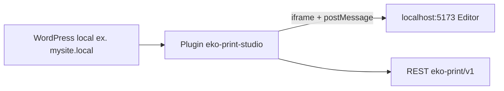
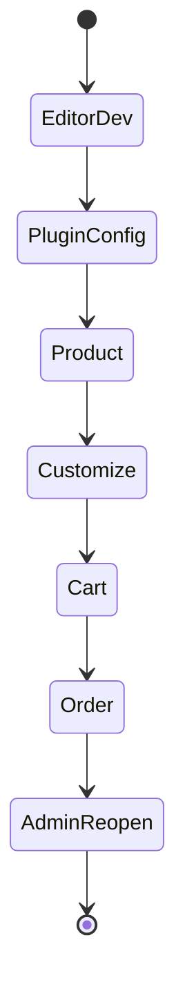

# Exemplo completo — ambiente local

## Objetivo

Em uma tarde, ter:

1. Editor Vite local
2. WordPress + WooCommerce local
3. Plugin Eko ativo
4. Produto personalizável
5. Carrinho e pedido com meta Eko
6. Reabertura no admin

Sem ler o Core.

---

## Arquitetura do exemplo



---

## Parte A — Editor

```bash
cd Eko-Print-Studio
npm install
npm run dev
```

**Resultado esperado:** terminal Vite mostra URL, tipicamente:

```text
http://localhost:5173/
```

Abra no navegador: canvas Demo / Creator carrega.

> 

```bash
# Em outro terminal
npm test
```

**Resultado esperado:** testes passam.

---

## Parte B — WordPress + WooCommerce

1. Crie um site local (LocalWP, Laravel Herd, XAMPP, Docker — qualquer um)
2. Instale WordPress
3. Instale e ative **WooCommerce** (wizard básico: loja BR, moeda BRL)
4. Crie páginas de loja padrão se o wizard pedir

**Resultado esperado:** `/shop` (ou equivalente) lista produtos.

---

## Parte C — Instalar o plugin Eko

Copie a pasta:

```text
Eko-Print-Studio/integrations/woocommerce/eko-print-studio
→ <wordpress>/wp-content/plugins/eko-print-studio
```

PowerShell (ajuste caminhos):

```powershell
Copy-Item -Recurse `
  "C:\Users\alexs\Documents\Jobs_2025\Plugins\Eko-Print-Studio\integrations\woocommerce\eko-print-studio" `
  "C:\caminho\do\wordpress\wp-content\plugins\eko-print-studio"
```

1. **Plugins → Ativar** Eko Print Studio for WooCommerce
2. **Configurações → Links permanentes → Salvar**

**Resultado esperado:** menu **WooCommerce → Eko Print Studio**.

---

## Parte D — Configurar o plugin

**WooCommerce → Eko Print Studio**

| Campo | Valor |
|-------|-------|
| URL do Editor | `http://localhost:5173` |
| Modo | `Modal` |
| Ambiente | `Development` |
| Target Origin | `http://localhost:5173` |
| Debug | ligado |
| Texto do botão | `Personalizar` |

Salvar.

> 

> **Atenção:** se o WP usa HTTPS (`https://mysite.local`) e o editor HTTP, o navegador pode bloquear iframe (mixed content). Opções: rodar WP em HTTP local, ou colocar o editor atrás de HTTPS de desenvolvimento (**a confirmar** no seu stack).

---

## Parte E — Produto

1. **Produtos → Adicionar**
2. Nome: `Caneca Brasil Demo`
3. Preço: `59.90`
4. Em **Template Master**: selecione **Caneca Brasil**
5. Publicar
6. Abrir o produto na loja

**Resultado esperado:** botão **Personalizar**.

> 

---

## Parte F — Personalizar e carrinho

1. Clique **Personalizar**
2. Espere o iframe carregar o editor
3. Altere um texto no canvas
4. Clique **Save** (modo commerce)
5. Você deve ir ao **carrinho**

**Resultado esperado:**

- Item com indicação de personalização / sessão
- Network: `product-context` 200 e `add-to-cart` 200

> 
> 

---

## Parte G — Pedido e admin

1. Conclua checkout (pode usar gateway de teste / pagamento na entrega)
2. No admin: **Pedidos →** abra o pedido
3. No item, localize o painel **Eko Print Studio**
4. Clique **Reabrir Personalização** / **Abrir Editor**

**Resultado esperado:** editor abre com sessão; meta `_eko_commerce_order` presente.

> 

---

## Diagrama do que você validou



---

## Checklist

### O que deve funcionar

- [ ] Vite + WP + plugin + produto + carrinho + pedido + reopen

### Como validar

- [ ] Console host e iframe sem erros fatais
- [ ] Audit/debug (se ligado) registra eventos
- [ ] Order item meta não vazia

### Erros mais comuns

- Vite parado
- Mixed content
- Permalinks
- Template ID errado
- Target Origin `*` vs origem estrita inconsistente

→ [Troubleshooting](../05-troubleshooting.md)
