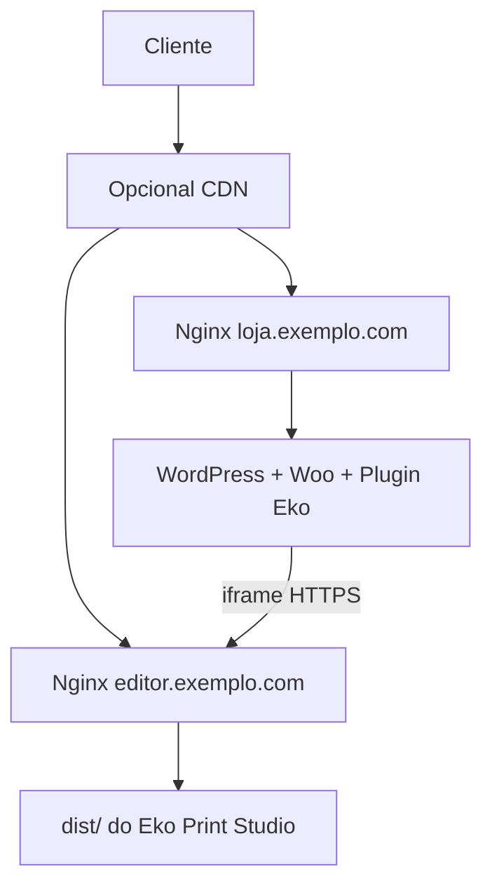
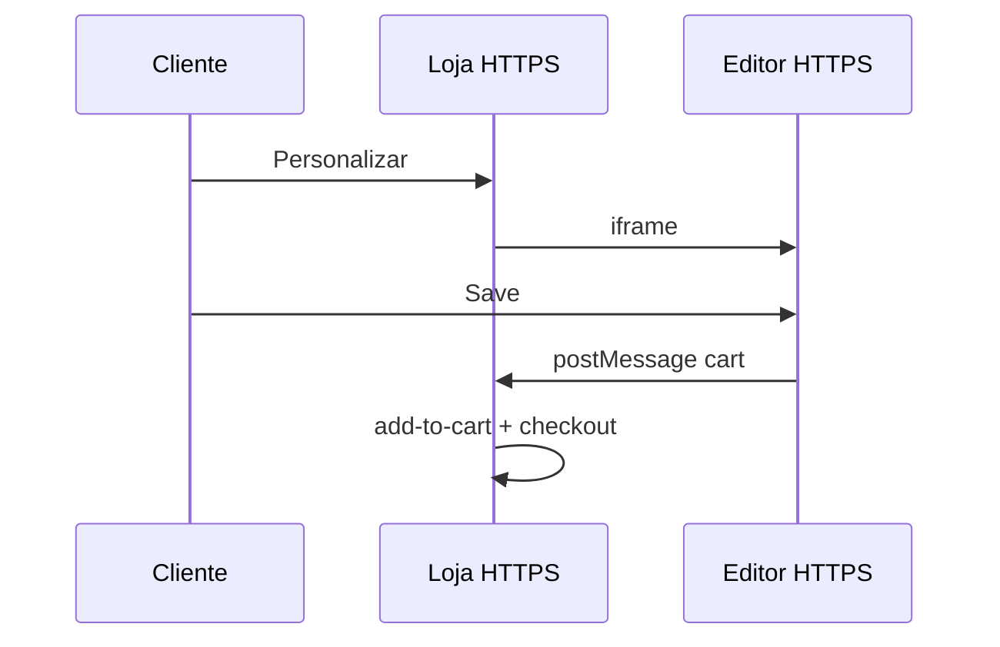

# Exemplo completo — produção

## Objetivo

Publicar o editor em um VPS Linux com HTTPS e conectar uma loja WooCommerce real (ou staging).

Este guia usa **Nginx** como exemplo principal e inclui notas **Apache**.

> **A confirmar:** paths, DNS e painéis (Plesk/cPanel) variam. Adapte nomes de domínio.

---

## Arquitetura alvo



---

## Pré-requisitos do servidor

- Ubuntu 22.04+ (ou similar)
- Node 20+ (só na máquina de **build**; o servidor web pode servir só estáticos)
- Nginx (ou Apache)
- Certbot / SSL
- WordPress + WooCommerce já instalados na loja

---

## Passo 1 — Build do editor

Na CI ou no notebook:

```bash
git clone <seu-repo> eko-print-studio
cd eko-print-studio
git checkout <tag-ou-branch-estavel>
npm ci
npm test
npm run build
```

Empacote `dist/`:

```bash
tar -czf eko-editor-dist.tar.gz -C dist .
```

**Resultado esperado:** artefato com `index.html` + `assets/`.

---

## Passo 2 — Deploy dos estáticos (Nginx)

No servidor:

```bash
sudo mkdir -p /var/www/eko-print-studio
sudo tar -xzf eko-editor-dist.tar.gz -C /var/www/eko-print-studio
sudo chown -R www-data:www-data /var/www/eko-print-studio
```

Site Nginx:

```nginx
server {
  listen 443 ssl http2;
  server_name editor.exemplo.com;

  ssl_certificate     /etc/letsencrypt/live/editor.exemplo.com/fullchain.pem;
  ssl_certificate_key /etc/letsencrypt/live/editor.exemplo.com/privkey.pem;

  root /var/www/eko-print-studio;
  index index.html;

  location / {
    try_files $uri $uri/ /index.html;
  }

  location /assets/ {
    expires 7d;
    add_header Cache-Control "public, immutable";
  }

  # Evite X-Frame-Options DENY — a loja embute o editor
  # Prefira CSP frame-ancestors com a origem da loja, se necessário:
  # add_header Content-Security-Policy "frame-ancestors https://loja.exemplo.com";
}
```

```bash
sudo nginx -t && sudo systemctl reload nginx
```

DNS: `editor.exemplo.com` → IP do VPS.

```bash
sudo certbot --nginx -d editor.exemplo.com
```

**Resultado esperado:** `https://editor.exemplo.com` abre o Creator.

> 

---

## Passo 3 — Variante Apache

```apache
<VirtualHost *:443>
  ServerName editor.exemplo.com
  DocumentRoot /var/www/eko-print-studio

  SSLEngine on
  SSLCertificateFile /etc/letsencrypt/live/editor.exemplo.com/fullchain.pem
  SSLCertificateKeyFile /etc/letsencrypt/live/editor.exemplo.com/privkey.pem

  <Directory /var/www/eko-print-studio>
    Require all granted
    FallbackResource /index.html
  </Directory>
</VirtualHost>
```

---

## Passo 4 — Instalar / atualizar o plugin na loja

1. Envie `integrations/woocommerce/eko-print-studio/` para `wp-content/plugins/eko-print-studio/`
2. Ative o plugin
3. Salve permalinks

---

## Passo 5 — Configuração de produção do plugin

| Campo | Valor |
|-------|-------|
| URL do Editor | `https://editor.exemplo.com` |
| Modo | `modal` ou `page` |
| Ambiente | `production` |
| Target Origin | `https://editor.exemplo.com` |
| Debug | off |

**Não use** `*` como Target Origin em produção.

---

## Passo 6 — Smoke test de loja

1. Produto com `template_caneca-brasil` (ou seu master real)
2. Personalizar → editar → Save
3. Carrinho → checkout
4. Admin reopen



---

## Passo 7 — Atualização e rollback

### Atualizar editor

```bash
# build novo → tar → extrair em /var/www/eko-print-studio
# manter /var/www/eko-print-studio.bak do release anterior
```

### Rollback editor

```bash
sudo rm -rf /var/www/eko-print-studio
sudo mv /var/www/eko-print-studio.bak /var/www/eko-print-studio
sudo systemctl reload nginx
```

### Plugin

Restaure a pasta anterior do plugin + permalinks.

---

## SSL — checklist

- [ ] Certificado válido na loja e no editor
- [ ] Sem mixed content
- [ ] HSTS **a confirmar** (só após ambos estáveis)

---

## Lacunas / riscos deste exemplo

| Item | Status |
|------|--------|
| Docker Compose oficial WP+Editor | Pendente |
| Headers CSP ideais por tema | A confirmar |
| CDN (CloudFront) na frente do `dist/` | Opcional; configure SPA error page |
| Thumbnail raster no e-mail do pedido | Depende ExportProvider |

---

## Checklist

### O que deve funcionar

- [ ] Editor HTTPS público
- [ ] Plugin aponta para ele
- [ ] Fluxo commerce completo em staging antes de produção real

### Como validar

- [ ] SSL Labs / navegador sem aviso
- [ ] postMessage com Target Origin estrito
- [ ] Pedido com `_eko_commerce_order`

### Erros mais comuns

- Esquecer SPA `try_files`
- Target Origin com `www` vs apex
- Cache CDN servindo `index.html` antigo
- `X-Frame-Options: DENY` no editor

→ [04 — Produção](../04-production.md) · [05 — Troubleshooting](../05-troubleshooting.md)
